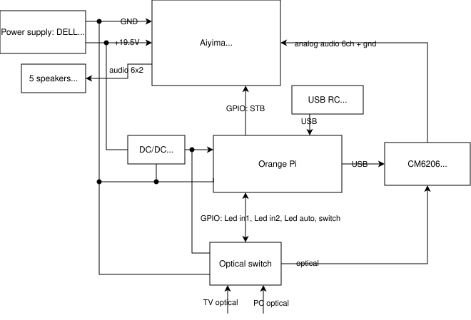

# Audio Hub 2.0 idea and migration

## Hardware

Diagram:



GPIO still not conected which means:

1. STB (standby activated with LO) doesn't work no saving energy
2. Optical switch set on auto (not perfect) - work simmilar to pevious switch
   by cycling Auto, Ch1, Ch2... pushing button
3. Important is that even in Alsamixer volume is set to 0 it is still laud
4. I don't have active filters on subwoofer, other speakers has it, but minimal one
5. I messup connection of speakers (swaped central with subwoofer)
6. During migration DAC GPIO selector and LED feedback stay commented out in
   `devices.py`. Uncomment only those lines when the external connector is back.

## Software migration

1. Concept of the migration is do smallest changes possible onece at the time
2. Minimal config for now is to have radio working (with working volume controll)
3. Everytime updating system files new file is added to `system_files`
4. Everytime new package is installed information is added on last chprer here 
   `installation`
5. `CamillaDSP` will be central part of the system for audio transformation and
   should take all heavy lifting. ALSA should stay minimal and feed audio into
   CamillaDSP, while filters, balancing, remapping, and 6 channel output live
   in CamillaDSP.
6. Version 1.0 is described here: [AudioHub v1.0](doc/v1_documentation.md)
7. Current target pipeline: `VLC/bluealsa-aplay -> ALSA loopback 2ch -> CamillaDSP -> USB ALSA 6ch`


## Current Notes

1. Database of streams: http://fmstream.org/index.php

Remote layout, left to right and top to bottom:

```text
KEY_POWER
KEY_MUTE
KEY_PAGEUP
(mouse button is not an event)
KEY_PAGEDOWN
KEY_UP
KEY_DOWN
KEY_LEFT
KEY_RIGHT
KEY_SELECT
KEY_BACK
KEY_HOMEPAGE
KEY_VOLUMEDOWN
KEY_VOICECOMMAND
KEY_VOLUMEUP
KEY_PREVIOUSSONG
KEY_PLAYPAUSE
KEY_NEXTSONG
KEY_0 ... 9
KEY_BACKSPACE
KEY_COMPOSE
```

## Installation

```text
pip install OPi.GPIO dbus-next
python3 -m pip install --user --upgrade pip setuptools wheel
pip install evdev python-vlc
python3 -m pip install --user git+https://github.com/HEnquist/pycamilladsp.git
pip install uvicorn fastapi sse-starlette
```

In `/etc/boot/orangepiEnv.txt` add:

```text
overlays=spi-spidev1
```

### CamillaDSP

1. Download from github: https://github.com/HEnquist/camilladsp/releases
2. For this OrangePi use the plain ALSA build: `camilladsp-linux-aarch64.tar.gz`
3. Archive downloaded to: `/home/kosiu/Downloads/camilladsp-linux-aarch64.tar.gz`
4. Installed to: `/home/kosiu/opt/camilladsp-v4.1.3/camilladsp`
5. Tracked systemd unit: `system_files/camilladsp.service`
6. Service starts websocket on `127.0.0.1:1234`, loads
   `/home/kosiu/camilladsp/default_config.yml`, keeps
   state in `/home/kosiu/camilladsp/statefile.yml`, and logs to
   `/home/kosiu/camilladsp/camilladsp.log`
7. First tracked config: `camilladsp_minimal.yml`
8. Minimal live config copied to:
   `/home/kosiu/camilladsp/default_config.yml`
9. Minimal live config also copied to:
   `/home/kosiu/camilladsp/configs/audio_hub_minimal.yml`
10. Minimal config captures stereo from `hw:Loopback,0,0` and plays 6 channels to
    `hw:ICUSBAUDIO7D`
11. To make the loopback card appear after boot, install:
    `sudo cp /home/kosiu/audio_hub/system_files/camilladsp-aloop.conf /etc/modules-load.d/`
12. Replace `/etc/asound.conf` with the tracked thin loopback handoff so VLC and
    `bluealsa-aplay` feed CamillaDSP:
    `sudo cp /home/kosiu/audio_hub/system_files/asound.conf /etc/asound.conf`
13. Audio Hub uses the Python CamillaDSP client to control main volume over the
   local websocket.
14. Install it with root privileges:
   `sudo cp /home/kosiu/audio_hub/system_files/camilladsp.service /etc/systemd/system/`
15. Then enable it:
   `sudo systemctl daemon-reload && sudo systemctl enable --now camilladsp.service`

### CamillaGUI

1. Download from github: https://github.com/HEnquist/camillagui-backend/releases
2. For this OrangePi use the bundled Linux backend: `bundle_linux_aarch64.tar.gz`
3. Archive downloaded to: `/home/kosiu/Downloads/bundle_linux_aarch64.tar.gz`
4. Installed to: `/home/kosiu/opt/camillagui-v4.1.0/camillagui_backend/`
5. Executable path: `/home/kosiu/opt/camillagui-v4.1.0/camillagui_backend/camillagui_backend`
6. Default work dirs prepared for GUI: `/home/kosiu/camilladsp/configs` and `/home/kosiu/camilladsp/coeffs`
7. Start with:
   `/home/kosiu/opt/camillagui-v4.1.0/camillagui_backend/camillagui_backend`
8. GUI served at: `http://127.0.0.1:5005/gui/index.html`
9. Tracked systemd unit: `system_files/camillagui.service`
10. Install it with root privileges:
   `sudo cp /home/kosiu/audio_hub/system_files/camillagui.service /etc/systemd/system/`
11. Then enable it:
   `sudo systemctl daemon-reload && sudo systemctl enable --now camillagui.service`

### Audio Hub runtime

1. Tracked systemd unit: `system_files/audio_hub.service`
2. Starts after `camilladsp.service` because volume control now uses the local
   CamillaDSP websocket.
