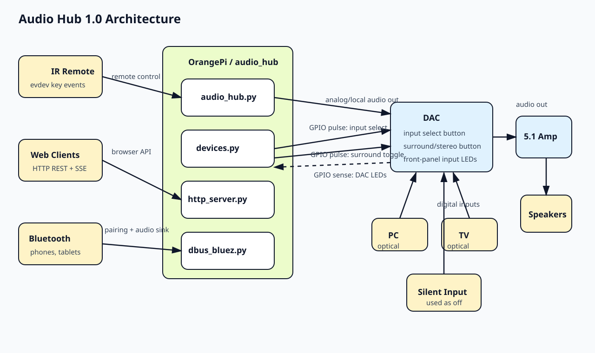

# Audio Hub 1.0

## Description

Audio Hub 1.0 is an OrangePi-based audio switcher and local audio source.
It selects the active DAC input, produces local audio for internet radio and Bluetooth sink, exposes control through IR remote and HTTP API, and mirrors a small part of the hardware state back into software.

OrangePi is the control center.
It reads commands from the infrared remote, the HTTP server and web UI, and Bluetooth pairing events.
It drives the DAC input selector through GPIO button emulation, the DAC surround or stereo toggle through GPIO button emulation, the DAC input state detection through GPIO reads of LED lines, ALSA volume, VLC internet radio playback, and BlueZ pairing mode with Bluetooth sink playback.

Audio path summary:

1. OrangePi produces local audio for radio and Bluetooth sink.
2. OrangePi analog or internal audio output goes into one DAC input.
3. PC and TV are connected to two DAC digital inputs.
4. One DAC digital input is used as a silent or off state.
5. DAC output goes to the 5.1 amplifier.
6. Amplifier output goes to speakers.

Important naming note:

The software action `bt` is a historical name.
In practice it means the OrangePi local audio path.
That path is shared by Bluetooth sink and internet radio.

Important power note:

The software action `off` does not power down the amplifier or DAC.
It selects a DAC input that is treated as silent.



## Software Architecture

Control flow summary:

1. `audio_hub.py` creates global runtime state.
2. It starts the HTTP server thread.
3. It starts Bluetooth event monitoring.
4. It discovers evdev input devices for IR and USB remote input.
5. Every command is normalized into `set_action()` or `set_volume()`.
6. Hardware-facing work is delegated to `devices.py` and `dbus_bluez.py`.

Runtime actions:

1. `0..9` selects a radio stream in VLC and forces the DAC to the OrangePi local input.
2. `bt` selects the OrangePi local input.
3. `pc` selects the PC DAC input.
4. `tv` selects the TV DAC input.
5. `off` selects the silent DAC input.
6. `stereo` toggles surround or stereo on the DAC or amplifier side.
7. `pair` enables temporary Bluetooth pairing mode.
8. `reboot` reboots the whole OrangePi.

## Hardware Interface

### DAC input select

Owned by `devices.py`.

1. There is no direct source-select bus.
2. OrangePi emulates a press of the DAC input button by pulling one GPIO line low for about `0.2s`.
3. The DAC moves to the next input in its own internal cycle.
4. Software waits about `0.8s` for the DAC to react.
5. Software reads three LED sense lines to infer which input is active.
6. Software repeats the fake button press until the inferred input matches the requested logical state.

### DAC state feedback

Owned by `devices.py`.

1. Three GPIO inputs watch three LED lines.
2. LED1 low means optical input 1.
3. LED2 low means optical input 2.
4. LED3 low means coaxial input.
5. If none is active, software treats that as input `0`, which is the OrangePi local path.

### Surround or stereo toggle

Owned by `devices.py`.

1. OrangePi emulates a press of another physical button.
2. The line is pulled low for about `0.2s`.
3. There is no readback.

### Local audio production

Owned mostly by `audio_hub.py`.

1. VLC plays internet radio streams.
2. `bluealsa-aplay` plays Bluetooth sink audio.
3. Both rely on the OrangePi audio stack.
4. Both share one physical DAC input path.

### Input devices

Owned by `audio_hub.py`.

1. Commands come from Linux evdev key events.
2. Supported device names are hard-coded.
3. Long press for some keys is detected by a timing hack because one remote does not send proper hold events.

## File Map

### Runtime files

| File | Description |
| --- | --- |
| `audio_hub.py` | Main runtime, state, command dispatch, radio playback, and IR loop. Main application. Translates remote and API requests into player, mixer, Bluetooth, and DAC actions. |
| `audio_hub.sh` | Wrapper script for the Python process. Restarts `audio_hub.py` only when it exits with code `121`. |
| `devices.py` | GPIO adapter for DAC control and state sensing. Owns the hardware-facing GPIO contract. |
| `dbus_bluez.py` | BlueZ pairing control and Bluetooth sink helper processes. Starts helper processes and manages temporary pairing mode through D-Bus. |
| `http_server.py` | REST API, SSE updates, and static file serving. FastAPI server used by the browser UI and other HTTP clients. |
| `radios.json` | Static list of radio station names and stream URLs. |
| `system_cfg.py` | System file snapshot helper. Copies tracked live system files into `system_files/`. |
| `plot.py` | Local thermal plotting helper. Plots CPU temperatures. Not part of the audio runtime. |
| `piano2.wav` | Local audio asset not referenced by the runtime. |

### Web UI files

| File | Description |
| --- | --- |
| `static/index.html` | Browser control panel layout. Declares the controls for input selection, volume, pairing, reboot, and theme. |
| `static/main.js` | Browser control logic. Sends REST requests, subscribes to SSE updates, and builds the radio button list. |
| `static/styles.css` | Small custom styling on top of Bootstrap. |
| `static/favicon.ico` | Browser favicon. |
| `static/favicon-192x192.png` | Larger icon for browsers and pinned shortcuts. |

### Deployment and OS integration files

| File | Description |
| --- | --- |
| `system_files/audio_hub.service` | Systemd unit for boot startup. Starts the wrapper script after the network is up. |
| `system_files/bluez-alsa` | Bluetooth audio sink configuration. Enables A2DP sink mode. |
| `system_files/99-gpio.rules` | GPIO and LED permission rules. Grants service-user access to the sysfs nodes used by the app. |
| `system_files/asound.conf` | ALSA routing for local playback. Routes stereo input into the 5.1 USB audio device channels. |
| `system_files/logind.conf` | System power-key policy. Sets `HandlePowerKey=ignore` to avoid conflict with app behavior. |

## Detailed Notes

### `devices.py`

1. This file is the hardware abstraction layer.
2. It controls DAC input selection by emulating a front-panel button.
3. It controls surround or stereo mode by emulating another front-panel button.
4. It detects the current DAC source by reading LED lines.
5. The logical input map is `bt`, `pc`, `tv`, `off`.
6. `set_aux()` serializes overlapping source changes through the global `aux_to_select` variable.
7. `get_aux()` stores the inferred input state in `/dev/shm/aux`.

### `audio_hub.py`

1. This is the command router and main state holder.
2. It loads radio definitions from `radios.json`.
3. It creates an ALSA mixer on `Master`.
4. It starts the HTTP server with `http_server.run_thread(self)`.
5. It starts Bluetooth monitoring with `dbus_bluez.init()`.
6. It scans evdev devices and attaches async loops.
7. The state value `input` is overloaded and can hold either a DAC input name or a radio index.
8. A scheduled reboot is used as a workaround for long-running radio failures.
9. A missing evdev device can force the controlled restart path.

### `dbus_bluez.py`

1. This module defines the Bluetooth operating mode.
2. It starts `bt-agent` with `NoInputNoOutput` capability.
3. It starts `bluealsa-aplay` as the Bluetooth sink playback path.
4. It watches BlueZ adapter properties over D-Bus.
5. It blinks the red system LED while the adapter is discoverable.
6. It disables pairing automatically after a timeout or a new device event.

### `http_server.py`

1. This module is the HTTP integration surface.
2. `/` redirects to the static UI.
3. `/get` returns the current input and volume.
4. `/get_radios` returns the radio list.
5. `/set` mutates action and volume.
6. `/update` provides SSE updates for the UI.
7. The server binds to a fixed IP address: `192.168.1.18`.
8. The module also contains a local `State` mock for standalone UI testing.

## Current Notes

1. Database of streams: http://fmstream.org/index.php
2. The hidden web UI pairing button currently sends `bt pair`, but the backend action handlers accept `pair`.

Remote layout, left to right and top to bottom:

```text
KEY_POWER
KEY_MUTE
KEY_PAGEUP
(mouse button is not an event)
KEY_PAGEDOWN
KEY_UP
KEY_DOWN
KEY_LEFT
KEY_RIGHT
KEY_SELECT
KEY_BACK
KEY_HOMEPAGE
KEY_VOLUMEDOWN
KEY_VOICECOMMAND
KEY_VOLUMEUP
KEY_PREVIOUSSONG
KEY_PLAYPAUSE
KEY_NEXTSONG
KEY_0 ... 9
KEY_BACKSPACE
KEY_COMPOSE
```

## Installation

```text
pip install OPi.GPIO dbus-next
pip install evdev python-vlc pyalsaaudio
pip install uvicorn fastapi sse-starlette
```

In `/etc/boot/orangepiEnv.txt` add:

```text
overlays=spi-spidev1
```
